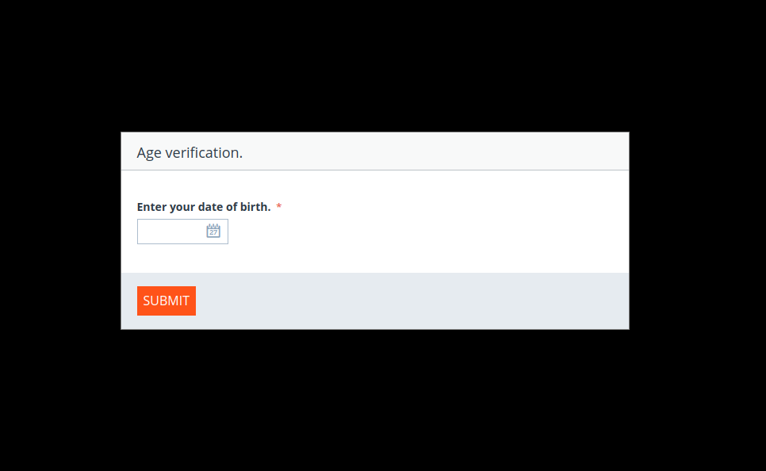
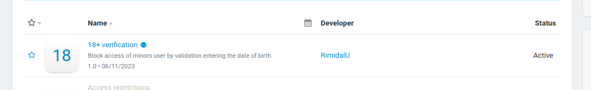

# 18+ check module for CS-Cart.

> New 18+ verification module in CS-Cart. 


---

[Description](#description) •
[Project setup](#project-setup) •
[Features](#features) •
[Project Status](#project-status) •
[Contact](#contact)




## Description

Addon for block access of minors user by validation entering the date of birth.

## Project setup

- Clone this repo to your desktop.
- Сonfigure administration tool for MySQL according to his instructions.
> - To populate with bd testsfake data import the file [simtechdev_departments_store.sql](../var/mydb/simtechdev_departments_store.sql) to MySQL bd (For example ```import -> Imported file``` in phpMyAdmin).
> - To add empty tables entity departments using sql queries from a file [departments_store.sql](../var//mydb/departments_store.sql). In phpMyAdmin choose ```simtechdev_departments``` table and inser in SQL tab queries.
> - To connect the module to app go to admin panel and activate modules `18+ verification` in the tab ```Add-ons```.
- To access the admin panel:
``` 
    login:    admin@example.com
    possword: admin
```

## Features
- New addon in CS-Cart.
- Implemented block access of minors user.

## Project Status

Project is: *in progress*

## Contact
Created by [@RimidalU](https://www.linkedin.com/in/uladzimir-stankevich/) - feel free to contact me!

<p align="right"><a href="#start"></a></p>